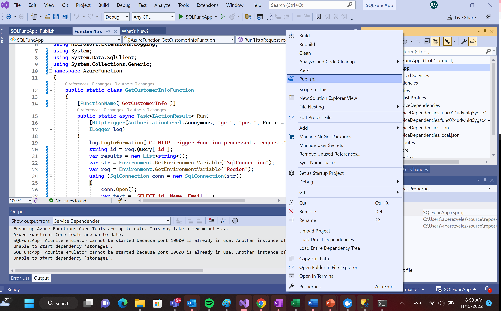
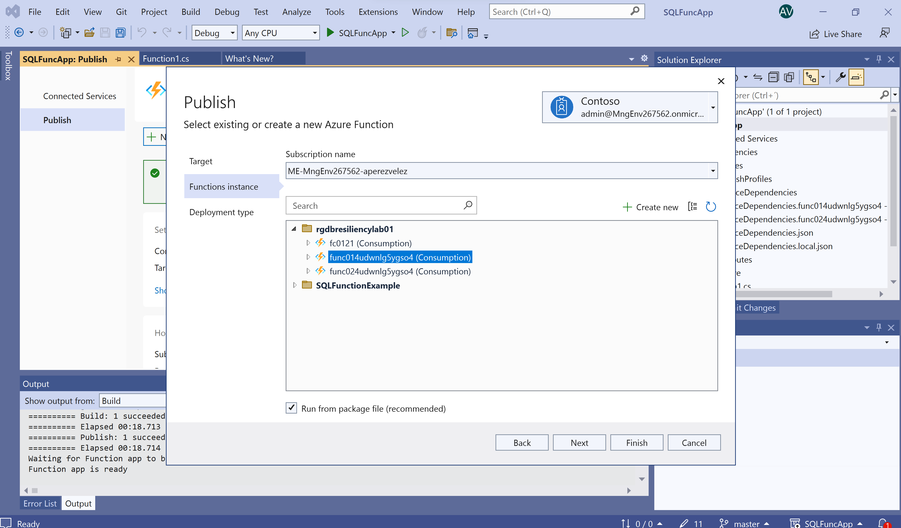

# csu_dbresiliency
# Publicación de Funciones

### [Prerequisitos](#prerequisitos)

### [Paso 1: Clonar branch master del repositorio](#paso-1)

### [Paso 2: Abrir Proyecto en Visual Studio](#paso-2)

### [Paso 3: Publicar las Funciones](#paso2)

# Prerequisitos

## Paso 1
## Clonar branch master del repositorio

Primero debemos clonar el branch master localmente:  git clone --branch master https://github.com/elrond01/csu_dbresiliency/

# Paso 2
## Abrir Proyecto en Visual Studio

En la ruta donde clonamos el repositorio abramos con Visual Studio el archivo SQLFuncApp.Sln

# Paso 3
## Publicar las Funciones

En la ruta donde clonamos el repositorio abramos con Visual Studio el archivo SQLFuncApp.Sln

Damos click derecho sobre la solución a la opción publish.

Buscamos una de las funciones que se crearon

Definimos el "Deployment type" generando un pubxml para publicar desde visual studio y damos click en "Finish"

Damos click en el botón Publish

Repetimos esta operación para la segunda función creada en la región West

