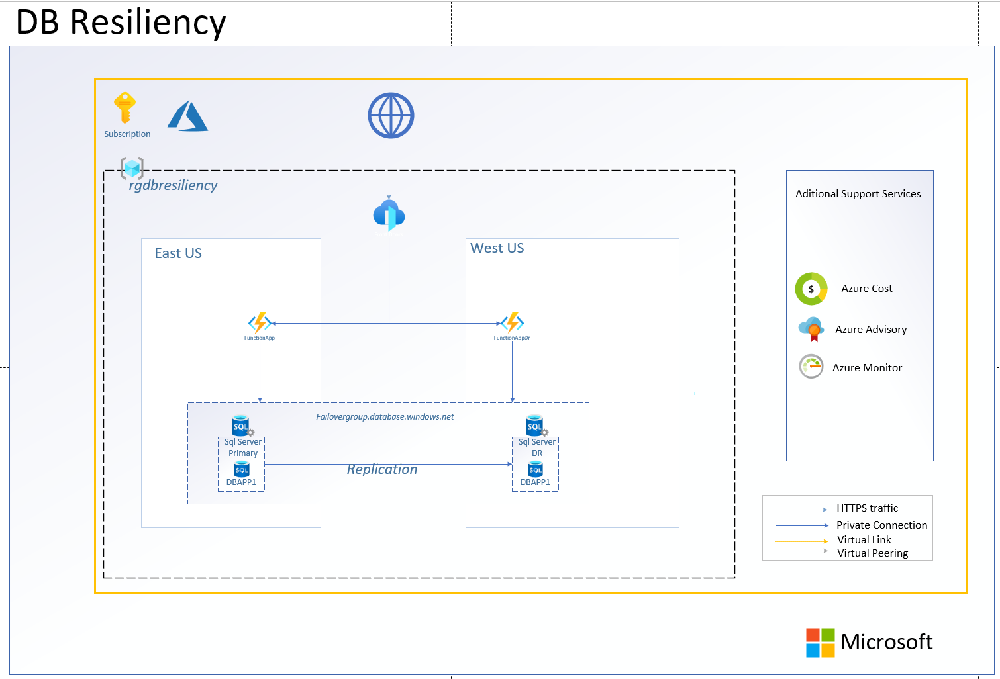

# Laboratorio resiliencia DB SQL Server (failover group)

### [Prerequisitos](#prerequisitos)

### [Paso 1: Crear servidor primario de base de datos servidor secundario y failover group](#paso-1)

### [Paso 2: Pruebas failover](#paso-2)

## General
El proposito de este microhack es demostrar el uso del failover group como mecanismo de resiliencia para bases de datos Azure SQL [Azure SQL FailOver Group Best Practices](https://learn.microsoft.com/en-us/azure/azure-sql/database/auto-failover-group-sql-db?view=azuresql&tabs=azure-powershell) y la interaccion con una app simulada en dos Functions con un balanceador global [Azure Front Door](https://learn.microsoft.com/es-es/azure/frontdoor/front-door-overview).



# Prerequisitos

## Paso 1
## Crear servidor primario de base de datos servidor secundario y failover group

Para desplegar el ambiente base utilizaremos bicep y va a ser deplegada en su subscripcion de azure en EAST US y su correspondiente region par WEST US para el DR tanto de nuestra base de datos como de nuestra aplicacion

- logearse a cloud shell (Powershell) ubicarse en ruta a clorar repositorio

`Cd repos`

- Clonar el repo 

`git clone https://github.com/elrond01/csu_dbresiliency.git`

- Ejecutar ./deploy.ps1

`cd ./csu_dbresiliency`

`./deploy.ps1`

- al final del despliegue se es presentado el nombre del failovergroup, necesario para la configuracion de la app, el usuario y contraseña para acceso a los servidores

-username:adminuser

-pass:SqlPasswd1234567

- conectarse por Portal a la base de datos primaria (la que no finaliza con en su nombre DR), y ejecutar el script de /sql/TablaCustomer.sql

## Paso 2
# Pruebas Failover

- Edite el script failover.ps1 alterando la variable SERVERNAME, con el nombre del servidor primario generado que se encuentra en el portal de azure dentro del Failover group de cualquiera de los dos servidores generados.

$serverName = {guid}

- Ejecute la seccion de asignacion de variables resourceGroupName,servername, failoverGroupName, drServerName

- Ejecute parcialmente las secciones de codigo:
  - Validacion de rol de servidor secundario

```
    Get-AzSqlDatabaseFailoverGroup -FailoverGroupName $failoverGroupName -ResourceGroupName $resourceGroupName -ServerName $drServerName).ReplicationRole
```

  
Valide en el portal el cambio de rol o ejecutando nuevamente el script de validacion de rol con el resultado `Secondary`

- Ejecute el failovergroup manual

```
Switch-AzSqlDatabaseFailoverGroup -ResourceGroupName $resourceGroupName -ServerName $drServerName -FailoverGroupName $failoverGroupName
```
  
Valide en el portal el cambio de rol o ejecutando nuevamente el script de validacion de rol con el resultado `Primary`

- Ejecute el cambio de rol nuevamente para restablecer el primario

```
Switch-AzSqlDatabaseFailoverGroup -ResourceGroupName $resourceGroupName -ServerName $serverName -FailoverGroupName $failoverGroupName
```
